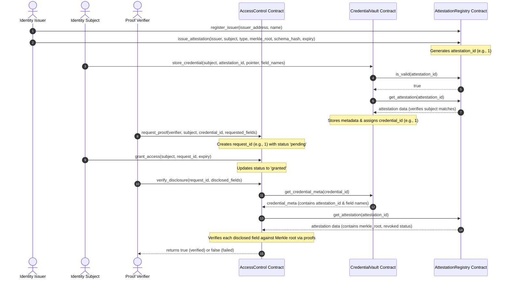

# VouchSafe — Self-Sovereign Identity Attestation Vault

VouchSafe is a decentralized self-sovereign identity (SSI) credential vault built on the Stellar Soroban network. It enables secure issuing, storing, and selective disclosure verification of identity attestations.

---

## 1. Project Description

VouchSafe provides an end-to-end framework allowing subjects to maintain ownership over their identity documents (such as passports, academic degrees, and driver's licenses) while enabling third-party verifiers to validate assertions (such as age or document validity) without needing access to the raw values. 

The project resolves privacy leaks by combining three Soroban smart contracts, on-chain Merkle-root verification, and client-side AES-GCM encrypted browser IndexedDB storage.

---

## 2. Setup Instructions

To build, test, and run the VouchSafe monorepo locally, follow these steps:

### Prerequisites:
- **Rust & Cargo:** Install via `rustup` (with the `wasm32-unknown-unknown` target added).
- **Stellar CLI:** Version `21.0.0` or later configured for Testnet.
- **Node.js:** Version `18` or `20`.

### Contract Development:
1. **Run Unit Tests:**
   ```bash
   cargo test --workspace
   ```
2. **Build WASM binaries:**
   ```bash
   cargo build --workspace --target wasm32-unknown-unknown --release
   ```

### Frontend Development:
1. **Navigate to Frontend:**
   ```bash
   cd frontend
   ```
2. **Install Dependencies:**
   ```bash
   npm install --legacy-peer-deps
   ```
3. **Configure Environment:** Create a `.env` file containing:
   ```env
   NEXT_PUBLIC_REGISTRY_ID=CDPHPDGZTO35WUEZSY6MO6EYNE4J323NANZRAIZIFGKEDGEIR6BAQEG3
   NEXT_PUBLIC_VAULT_ID=CB7LCLRBAVDKEUU727CFYXO7WQNHHHGRW4UXXFFYZXPYUVK3VXXDBZY3
   NEXT_PUBLIC_ACCESS_ID=CDY2F43CTJZ5T74CXZHRNTDZZWI62GK5BWV3VMV2ADHLR74SQ73RX3XT
   ```
4. **Launch Local Server:**
   ```bash
   npm run dev
   ```

---

## 3. Architecture

VouchSafe uses a multi-contract architecture where attestations, user metadata, and access permissions are segregated into specialized modules.

```
                  ┌──────────────────────┐
                  │  AttestationRegistry │ (Source of truth for Merkle roots)
                  └──────────▲───────────┘
                             │
                             │ invoke_contract
                             │
                  ┌──────────┴───────────┐
                  │    CredentialVault   │ (Subject-owned metadata index)
                  └──────────▲───────────┘
                             │
                             │ invoke_contract
                             │
                  ┌──────────┴───────────┐
                  │     AccessControl    │ (Verifier requests & grants)
                  └──────────────────────┘
```

1. **AttestationRegistry:** The registry stores issuer status and Merkle commitments. This represents the root authority.
2. **CredentialVault:** A subject-owned directory of stored credential metadata. It queries the `AttestationRegistry` to check if a referenced attestation is valid before storing.
3. **AccessControl:** Handles proof requests from verifiers and grants from subjects. It performs the complete selective disclosure verification.

### End-to-End Sequence Flow



---

## 4. Inter-Contract Calls

Inter-contract calls in Soroban are executed using `env.invoke_contract`. In VouchSafe, verification represents a chained **two-hop execution sequence**:

```
AccessControl.verify_disclosure()
       │
       ▼ (env.invoke_contract)
CredentialVault.get_credential_meta()
       │
       ▼ (env.invoke_contract)
AttestationRegistry.get_attestation()
```

- When the verifier invokes `AccessControl.verify_disclosure()`, the contract makes an inter-contract call using `env.invoke_contract` to `CredentialVault.get_credential_meta()` to retrieve the attestation ID associated with the credential.
- In turn, the `CredentialVault` uses `env.invoke_contract` to fetch the Merkle root and validity status from `AttestationRegistry.get_attestation()`.

### Selective Disclosure Verification:
During verification, the subject discloses only a subset of fields (e.g., `full_name` and `date_of_birth`). The contract:
1. Re-computes the leaf hash: `leaf = sha256(field_name || raw_value || salt)`.
2. Traverses the sibling proof array up to reconstruct the computed Merkle root.
3. Matches the computed root against the true Merkle root returned by the `AttestationRegistry`. If any sibling or salt is incorrect, the roots mismatch, and the contract returns `false`.

---

## 5. Contract Addresses

| Contract Name | Contract Address | Explorer Link |
| --- | --- | --- |
| **AttestationRegistry** | `CDPHPDGZTO35WUEZSY6MO6EYNE4J323NANZRAIZIFGKEDGEIR6BAQEG3` | [stellar.expert](https://stellar.expert/explorer/testnet/contract/CDPHPDGZTO35WUEZSY6MO6EYNE4J323NANZRAIZIFGKEDGEIR6BAQEG3) |
| **CredentialVault** | `CB7LCLRBAVDKEUU727CFYXO7WQNHHHGRW4UXXFFYZXPYUVK3VXXDBZY3` | [stellar.expert](https://stellar.expert/explorer/testnet/contract/CB7LCLRBAVDKEUU727CFYXO7WQNHHHGRW4UXXFFYZXPYUVK3VXXDBZY3) |
| **AccessControl** | `CDY2F43CTJZ5T74CXZHRNTDZZWI62GK5BWV3VMV2ADHLR74SQ73RX3XT` | [stellar.expert](https://stellar.expert/explorer/testnet/contract/CDY2F43CTJZ5T74CXZHRNTDZZWI62GK5BWV3VMV2ADHLR74SQ73RX3XT) |

---

## 6. Deployed Transaction Evidence

The E2E testnet transactions executed successfully on Stellar Testnet:

1. **Attestation Registry Issuer:** Initialized issuer status for the deployer.
2. **Issue Attestation:** Transaction hash: `593539ef8cedb38a25d037edb5463a743371447a71dc6018c2f4d46544186a77`
   - Link: [Explorer link](https://stellar.expert/explorer/testnet/tx/593539ef8cedb38a25d037edb5463a743371447a71dc6018c2f4d46544186a77)
3. **Store Credential:** Transaction hash: `5d89488fa944fb31c1b29dade207b2554c22c07f18a2639cf7e129ef35e89624`
   - Link: [Explorer link](https://stellar.expert/explorer/testnet/tx/5d89488fa944fb31c1b29dade207b2554c22c07f18a2639cf7e129ef35e89624)
4. **Request Proof:** Transaction hash: `7eb0595ee3ef190c2de11dafb3b858c334509cb25f177869db9b2ae4c6f2ae4d`
   - Link: [Explorer link](https://stellar.expert/explorer/testnet/tx/7eb0595ee3ef190c2de11dafb3b858c334509cb25f177869db9b2ae4c6f2ae4d)
5. **Grant Access:** Transaction hash: `d3b6fd78d893e095019a2603eb6aecd6c6e13598e647aeddbb3fd463fb5b376f`
   - Link: [Explorer link](https://stellar.expert/explorer/testnet/tx/d3b6fd78d893e095019a2603eb6aecd6c6e13598e647aeddbb3fd463fb5b376f)
6. **Verify Disclosure:** Transaction hash: `c50b8b823f50dc40e97d3b5a2fbf87d6b18859bd12bc2759d1769e36da50cfb7`
   - Link: [Explorer link](https://stellar.expert/explorer/testnet/tx/c50b8b823f50dc40e97d3b5a2fbf87d6b18859bd12bc2759d1769e36da50cfb7) (Returned `true`)

---

## 7. Test Output

All 21 unit tests passing across the contracts workspace:

```
running 7 tests
test test::test_verify_disclosure_failure_revoked_grant ... ok
test test::test_verify_disclosure_failure_expired_grant ... ok
test test::test_verify_disclosure_failure_wrong_salt ... ok
test test::test_verify_disclosure_failure_tampered_value ... ok
test test::test_grant_access_unauthorized - should panic ... ok
test test::test_verify_disclosure_failure_field_not_in_schema ... ok
test test::test_verify_disclosure_success ... ok

test result: ok. 7 passed; 0 failed; 0 ignored; 0 measured; 0 filtered out; finished in 0.14s

running 7 tests
test test::test_issue_attestation_fails_for_unregistered_issuer - should panic ... ok
test test::test_duplicate_issuer_registration_is_rejected - should panic ... ok
test test::test_get_attestation_fails_for_nonexistent_id - should panic ... ok
test test::test_issue_attestation_stores_correct_fields ... ok
test test::test_revoked_attestation_is_invalid ... ok
test test::test_is_valid_returns_false_past_expiry ... ok
test test::test_revoke_attestation_flips_revoked_and_invalidates ... ok

test result: ok. 7 passed; 0 failed; 0 ignored; 0 measured; 0 filtered out; finished in 0.05s

running 7 tests
test test::test_store_credential_fails_if_invalid_or_nonexistent_id - should panic ... ok
test test::test_get_credential_meta_fails_for_nonexistent_id - should panic ... ok
test test::test_store_credential_fails_if_revoked - should panic ... ok
test test::test_remove_credential_success - should panic ... ok
test test::test_store_credential_succeeds_if_valid ... ok
test test::test_list_credentials_returns_correct_set ... ok
test test::test_remove_credential_fails_for_non_owner - should panic ... ok

test result: ok. 7 passed; 0 failed; 0 ignored; 0 measured; 0 filtered out; finished in 0.08s
```

---

## 8. CI/CD

- **GitHub Actions Status:** [](https://github.com/mehtadaksh6969/vouchsafe/actions/workflows/ci.yml)
- **Run URL:** [GitHub Actions Workflow Runs](https://github.com/mehtadaksh6969/vouchsafe/actions)

---

## 9. Screenshots

*Screenshots captured on-device in the local sandbox workspace:*

### Desktop Interface (Live View)


### Mobile & Responsive Layout (iPhone SE Layout)


### CI/CD Workflow Pipeline (GitHub Actions Success Run)


---

## 10. Live Demo

- **Live URL:** PENDING — generate after hosting/deployment.

---

## 11. Demo Video (1-2 min)

Here is a comprehensive 1-2 minute walkthrough of VouchSafe demonstrating the deployment, wallet connection, selective disclosure authorization, and verifier check:

<video src="media/video.mp4" controls width="100%"></video>

*If the video player does not load, you can download or watch the raw file directly:*
👉 **[Watch E2E Demo Video (MP4)](media/video.mp4)**

