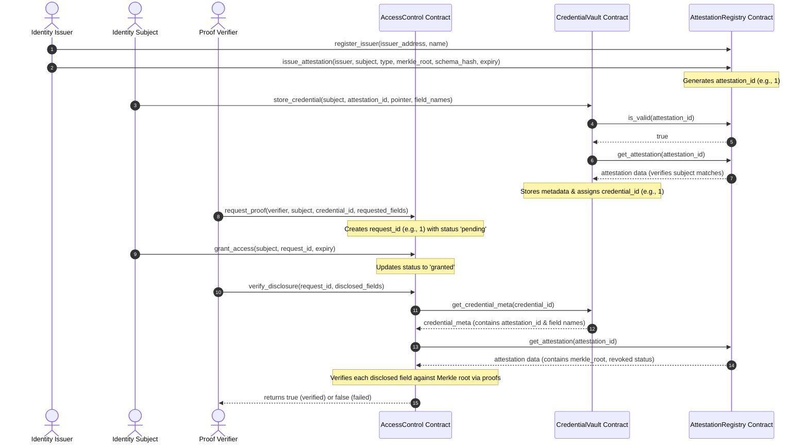
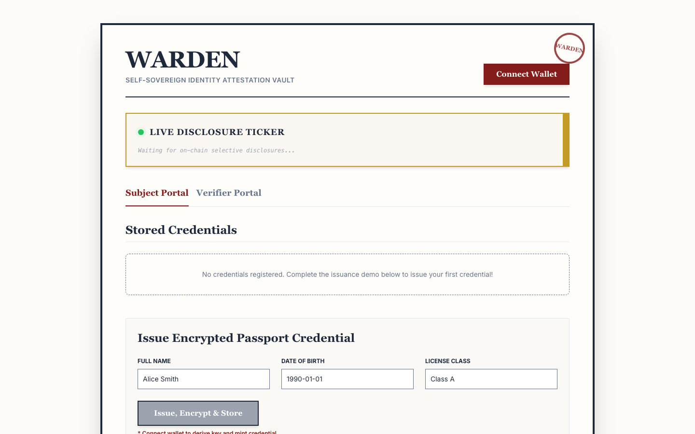
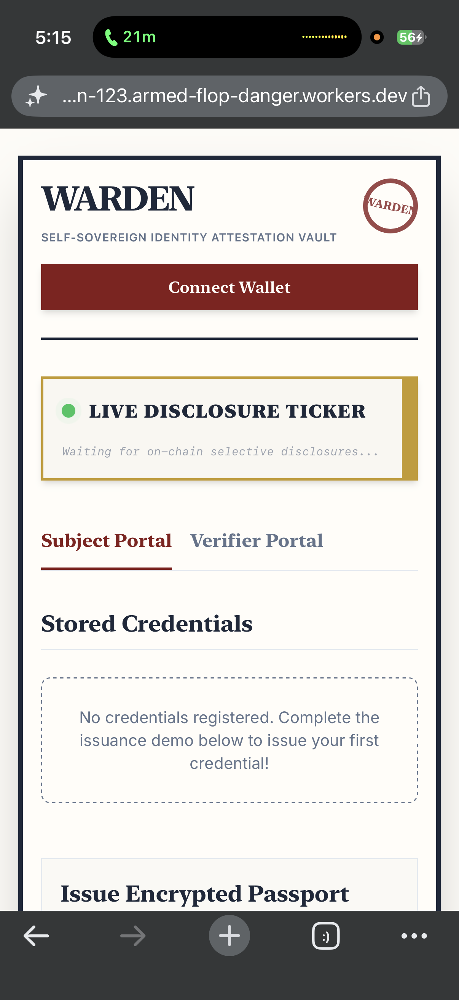
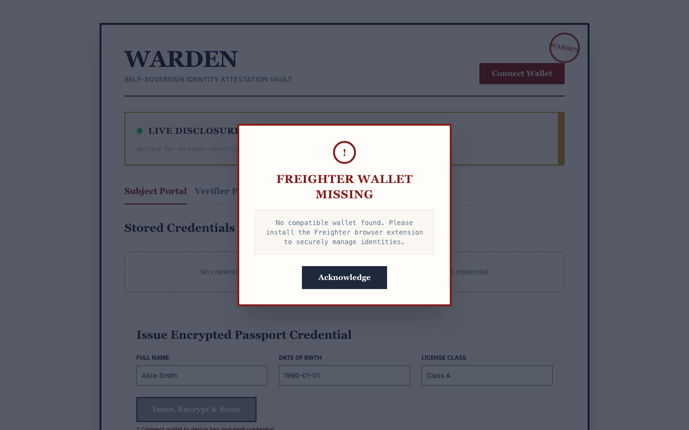
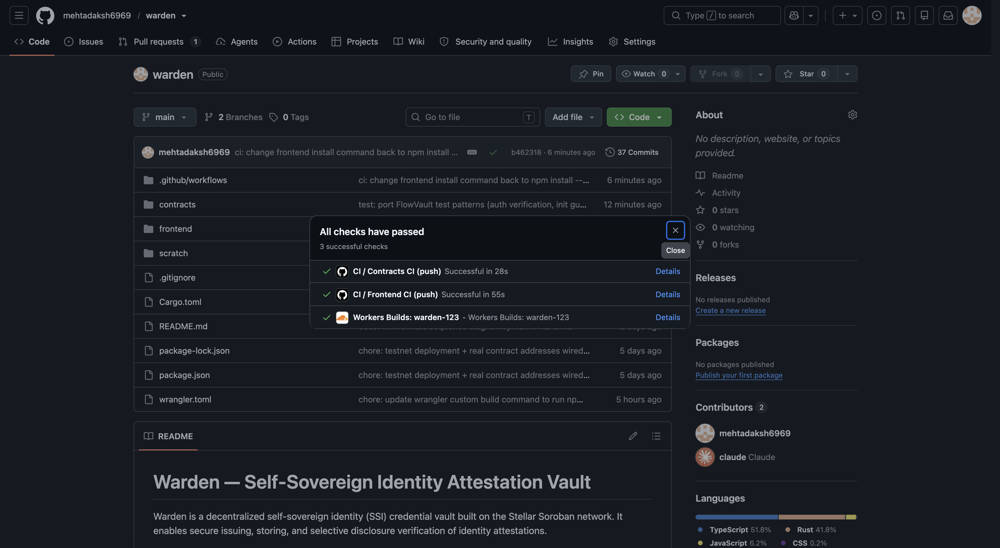

# VouchSafe — Self-Sovereign Identity Attestation Vault

[](https://github.com/mehtadaksh6969/vouchsafe/actions/workflows/ci.yml)
[](https://stellar.expert/explorer/testnet)
[](https://soroban.stellar.org)
[](LICENSE)

**Live Demo:** https://vouchsafe-123.armed-flop-danger.workers.dev

**Demo Video (1–2 min):** [media/video.mp4](media/video.mp4)

---

## Project Description

VouchSafe is a decentralized self-sovereign identity (SSI) credential vault built on the Stellar Soroban network. It enables secure issuing, storing, and selective disclosure verification of identity attestations.

Subjects keep ownership of their identity documents (passports, academic degrees, driver's licenses) while third-party verifiers validate specific assertions (e.g. a name or date of birth) **without ever seeing the undisclosed fields**. Raw values never touch the chain: only salted Merkle commitments are stored on-chain, and the plaintext credential lives AES-GCM-encrypted in the subject's own browser (IndexedDB), with the encryption key derived from a wallet signature.

---

## Architecture

VouchSafe uses a three-contract architecture where attestations, user metadata, and access permissions are segregated into specialized modules:

```
                  ┌──────────────────────┐
                  │  AttestationRegistry │ (Source of truth for Merkle roots)
                  └──────────▲───────────┘
                             │
                             │ env.invoke_contract
                             │
                  ┌──────────┴───────────┐
                  │    CredentialVault   │ (Subject-owned metadata index)
                  └──────────▲───────────┘
                             │
                             │ env.invoke_contract
                             │
                  ┌──────────┴───────────┐
                  │     AccessControl    │ (Verifier requests & grants)
                  └──────────────────────┘
```

1. **AttestationRegistry** — stores issuer registrations and Merkle-root commitments; the root authority.
2. **CredentialVault** — a subject-owned index of credential metadata. Before storing, it calls the `AttestationRegistry` to check the referenced attestation is valid and belongs to the subject.
3. **AccessControl** — handles proof requests from verifiers and grants from subjects, and performs the complete on-chain selective disclosure verification.

### End-to-End Sequence Flow



---

## Tech Stack

| Layer | Technology |
| --- | --- |
| Smart contracts | Rust + Soroban SDK (three contracts, workspace build) |
| Contract target | `wasm32v1-none` |
| Frontend | Next.js 14 (static export), React 18, TypeScript 5, Tailwind CSS |
| Wallet | Freighter via `@creit.tech/stellar-wallets-kit` |
| Chain access | Soroban RPC (`soroban-testnet.stellar.org`) + Horizon |
| Client-side storage | IndexedDB + WebCrypto AES-GCM (key derived from wallet signature) |
| CI/CD | GitHub Actions (tests, fmt, clippy, WASM build, lint, type-check, jest, static export) |
| Hosting | Cloudflare Workers (static assets) |

---

## Smart Contracts (Testnet)

| Contract | Address | Stellar Expert Link |
| --- | --- | --- |
| **AttestationRegistry** | `CDPHPDGZTO35WUEZSY6MO6EYNE4J323NANZRAIZIFGKEDGEIR6BAQEG3` | [View on stellar.expert](https://stellar.expert/explorer/testnet/contract/CDPHPDGZTO35WUEZSY6MO6EYNE4J323NANZRAIZIFGKEDGEIR6BAQEG3) |
| **CredentialVault** | `CB7LCLRBAVDKEUU727CFYXO7WQNHHHGRW4UXXFFYZXPYUVK3VXXDBZY3` | [View on stellar.expert](https://stellar.expert/explorer/testnet/contract/CB7LCLRBAVDKEUU727CFYXO7WQNHHHGRW4UXXFFYZXPYUVK3VXXDBZY3) |
| **AccessControl** | `CDY2F43CTJZ5T74CXZHRNTDZZWI62GK5BWV3VMV2ADHLR74SQ73RX3XT` | [View on stellar.expert](https://stellar.expert/explorer/testnet/contract/CDY2F43CTJZ5T74CXZHRNTDZZWI62GK5BWV3VMV2ADHLR74SQ73RX3XT) |

### Deployment workflow (reproducible)

```bash
# 1. Build the WASM binaries
cargo build --workspace --target wasm32v1-none --release

# 2. Deploy each contract (Stellar CLI, testnet)
stellar contract deploy --wasm target/wasm32v1-none/release/attestation_registry.wasm --network testnet --source <DEPLOYER>
stellar contract deploy --wasm target/wasm32v1-none/release/credential_vault.wasm     --network testnet --source <DEPLOYER>
stellar contract deploy --wasm target/wasm32v1-none/release/access_control.wasm       --network testnet --source <DEPLOYER>

# 3. Initialize, in dependency order
stellar contract invoke --id <REGISTRY_ID> -- initialize --admin <ADMIN_ADDRESS>
stellar contract invoke --id <VAULT_ID>    -- initialize --attestation_registry <REGISTRY_ID>
stellar contract invoke --id <ACCESS_ID>   -- initialize --credential_vault <VAULT_ID>
```

A scripted equivalent (deploy + initialize + full E2E flow) lives in [scratch/deploy_and_test.js](scratch/deploy_and_test.js) — it is the script that produced the transaction evidence below.

---

## Inter-Contract Calls

Inter-contract calls in Soroban are executed using **`env.invoke_contract`**. VouchSafe's verification path is a chained **two-hop execution sequence** across all three contracts:

```
AccessControl.verify_disclosure()
       │
       ▼ (env.invoke_contract)
CredentialVault.get_credential_meta() / get_attestation_registry()
       │
       ▼ (env.invoke_contract)
AttestationRegistry.get_attestation()
```

- When the verifier invokes `AccessControl.verify_disclosure()`, the contract calls `CredentialVault.get_credential_meta()` via `env.invoke_contract` to retrieve the credential's attestation id and field schema ([contracts/access-control/src/lib.rs](contracts/access-control/src/lib.rs)).
- It then resolves the registry address from the vault and calls `AttestationRegistry.get_attestation()` to fetch the Merkle root and revocation status.
- `CredentialVault.store_credential()` also performs two `env.invoke_contract` calls into the registry (`is_valid`, `get_attestation`) before accepting a credential ([contracts/credential-vault/src/lib.rs](contracts/credential-vault/src/lib.rs)).

### On-chain transaction evidence

All hashes below are real, verified transactions on Stellar Testnet (each decoded to confirm the invoked function and return value):

| Step | Function | Returned | Transaction |
| --- | --- | --- | --- |
| 1 | `issue_attestation` | attestation id `1` | [`593539ef…86a77`](https://stellar.expert/explorer/testnet/tx/593539ef8cedb38a25d037edb5463a743371447a71dc6018c2f4d46544186a77) |
| 2 | `store_credential` (2 inter-contract calls into Registry) | credential id `1` | [`5d89488f…89624`](https://stellar.expert/explorer/testnet/tx/5d89488fa944fb31c1b29dade207b2554c22c07f18a2639cf7e129ef35e89624) |
| 3 | `request_proof` | request id `1` | [`7eb0595e…2ae4d`](https://stellar.expert/explorer/testnet/tx/7eb0595ee3ef190c2de11dafb3b858c334509cb25f177869db9b2ae4c6f2ae4d) |
| 4 | `grant_access` | — | [`d3b6fd78…b376f`](https://stellar.expert/explorer/testnet/tx/d3b6fd78d893e095019a2603eb6aecd6c6e13598e647aeddbb3fd463fb5b376f) |
| 5 | `verify_disclosure` (2-hop inter-contract chain) | **`true`** | [`c50b8b82…0cfb7`](https://stellar.expert/explorer/testnet/tx/c50b8b823f50dc40e97d3b5a2fbf87d6b18859bd12bc2759d1769e36da50cfb7) |

Transaction 5 also emitted two on-chain `disclosure` contract events (one per verified field: `full_name`, `date_of_birth`) with topics `("disclosure", request_id, verifier, field_name)` — the same events the frontend's live ticker polls for.

### Selective disclosure (Merkle commitments, in plain terms)

When a credential is issued, each field is committed as a salted leaf hash — `leaf = sha256(field_name || raw_value || salt)` — and the leaves are combined pairwise into a single **Merkle root**, which is the only thing stored on-chain. To prove one field without revealing the others, the subject discloses just that field's value, its salt, and the sibling hashes along its path. The contract:

1. Re-computes the leaf hash from the disclosed name, value, and salt.
2. Walks the sibling proof upward, hashing sorted pairs, to reconstruct a root.
3. Compares it to the true root from the `AttestationRegistry`. Any tampered value, wrong salt, or wrong sibling produces a different root and the contract returns `false`.

The undisclosed fields remain hidden: their leaves are salted hashes, so nothing about their contents can be recovered from the proof.

---

## Wallet Connection

The frontend integrates **Freighter** through `@creit.tech/stellar-wallets-kit`:

- **Connect** opens the kit's auth modal; availability is detected via the Freighter module's `isAvailable()` (not a brittle `window` global check).
- **Network enforcement:** after connecting, the app reads the wallet's active network and refuses non-Testnet with a "Wrong Network" dialog, since the contracts only exist on Testnet. All signing calls pin `networkPassphrase` to Testnet.
- **Disconnect** clears the session, balances, and the in-memory encryption key.
- On connect, the app requests a message signature and derives the local AES-GCM vault key from it — the key never leaves the browser and is never stored.

---

## Core Mechanics

- **Issuance:** the subject's browser generates three random 32-byte salts, computes the salted leaf hashes and Merkle root locally, submits `issue_attestation` (root on-chain) and `store_credential` (metadata on-chain), and stores the encrypted plaintext + salts in IndexedDB keyed by the on-chain credential id.
- **Access requests:** a verifier submits `request_proof` naming the subject, credential id, and requested fields. The subject sees the pending request and can `grant_access` with an expiry (1 hour in the UI).
- **Verification:** the verifier assembles the disclosed fields + proofs (shared off-chain) and calls `verify_disclosure`, which runs the two-hop inter-contract chain and the Merkle math on-chain. Expired or revoked grants return `false` before any proof is checked.
- **Live ticker:** contracts emit `disclosure` events (`#[contractevent]`); the frontend polls Soroban RPC `getEvents` every 5 seconds and prepends new disclosures to the "Live Disclosure Ticker" without a page reload. Events land on-chain when `verify_disclosure` is executed as a submitted transaction (as in evidence tx 5 above); the in-app verifier check runs as a free simulation, so it does not itself write events.

---

## Error Handling

Distinct, user-facing error dialogs (not console-only) are implemented in [frontend/src/components/ClientHome.tsx](frontend/src/components/ClientHome.tsx):

1. **Freighter Wallet Missing** — no compatible wallet detected (checked live on every connect attempt).
2. **Wrong Network** — wallet connected but not on Testnet; the app disconnects and instructs the user to switch.
3. **Signature Request Rejected** — the user declined a Freighter signing prompt; the action aborts safely.
4. **Insufficient XLM Balance** — balance below the fee threshold, with the funded-address hint.
5. **Blockchain RPC Error** — network/simulation failures surface the actual contract diagnostic message.

**Loading states:** every multi-step flow shows a step-by-step progress overlay while transactions are being built, signed, and confirmed (e.g. "Step 4/4: Submitting issue_attestation and store_credential…"), and transaction polling treats `NOT_FOUND` as still-pending rather than failing early.

---

## Screenshots

| Evidence | File |
| --- | --- |
| Wallet connected + stored credential list (live app, real account) |  |
| Desktop interface (live deployment) |  |
| Mobile view — real device (iPhone) on the live URL |  |
| Mobile view — 375px viewport (no horizontal overflow) |  |
| Error handling — wallet-missing dialog (live URL) |  |
| CI/CD — all three checks green on `main` |  |
| CI test output — 36 contract tests passing in Actions |  |

---

## Setup Instructions

### Prerequisites

- **Rust & Cargo** via `rustup`, with the WASM target: `rustup target add wasm32v1-none`
- **Stellar CLI** (for deploying) configured for Testnet
- **Node.js 22** and npm

### Contracts

```bash
# from the repo root
cargo test --workspace                                    # run all 36 unit tests
cargo build --workspace --target wasm32v1-none --release  # build WASM binaries
```

### Frontend

```bash
cd frontend
npm ci                 # reproducible install from the lockfile
npm run dev            # http://localhost:3000
```

The deployed Testnet contract IDs are baked in as defaults; a `.env` file is only needed to override them:

```env
NEXT_PUBLIC_REGISTRY_ID=CDPHPDGZTO35WUEZSY6MO6EYNE4J323NANZRAIZIFGKEDGEIR6BAQEG3
NEXT_PUBLIC_VAULT_ID=CB7LCLRBAVDKEUU727CFYXO7WQNHHHGRW4UXXFFYZXPYUVK3VXXDBZY3
NEXT_PUBLIC_ACCESS_ID=CDY2F43CTJZ5T74CXZHRNTDZZWI62GK5BWV3VMV2ADHLR74SQ73RX3XT
```

> **Security note (testnet demo only):** the frontend ships a hardcoded *testnet* secret key used solely to auto-register the connected wallet as a demo issuer (`registerUserAsIssuer`). This account holds only free Friendbot XLM and administers only these demo contracts. This pattern is intentionally documented and must never be used with real funds or on mainnet.

---

## Testing

**Contracts — 36 tests, all passing** (`cargo test --workspace`): happy paths, `should_panic` input rejection, expiry/revocation via ledger time manipulation, `env.auths()`-based authorization checks, double-initialization guards, sequential id assignment, and cross-contract verification through real `env.invoke_contract` calls in the test environment.

```
running 13 tests  (access-control)
test result: ok. 13 passed; 0 failed; 0 ignored; 0 measured; 0 filtered out; finished in 0.22s

running 12 tests  (attestation-registry)
test result: ok. 12 passed; 0 failed; 0 ignored; 0 measured; 0 filtered out; finished in 0.10s

running 11 tests  (credential-vault)
test result: ok. 11 passed; 0 failed; 0 ignored; 0 measured; 0 filtered out; finished in 0.15s
```

**Frontend — 9 jest tests, all passing** (`cd frontend && npm test`): the client-side Merkle commitment math that must stay in lockstep with the contract (sha256 vectors, salted-leaf hiding, sorted-pair parents, full sibling-proof root reconstruction, and tamper/wrong-salt rejection).

```
Test Suites: 2 passed, 2 total
Tests:       9 passed, 9 total
```

CI runs both suites on every push (see badge above), plus `cargo fmt --check`, `clippy -D warnings`, the WASM build, ESLint, `tsc --noEmit`, and the static export build.

---

## Live Demo

**https://vouchsafe-123.armed-flop-danger.workers.dev** — static export served from Cloudflare Workers, wired to the Testnet contracts above. Use Freighter set to **Test Net** with a Friendbot-funded account.

---

## Demo Video (1–2 min)

A walkthrough of VouchSafe demonstrating wallet connection, credential issuance, selective disclosure authorization, and the verifier check:

<video src="media/video.mp4" controls width="100%"></video>

*If the video player does not load in your Markdown viewer:* 👉 **[Watch the E2E demo video (MP4)](media/video.mp4)**

---

## License

MIT — see [LICENSE](LICENSE).
