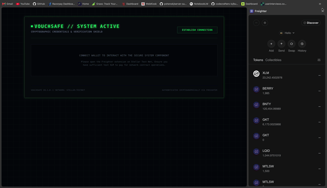
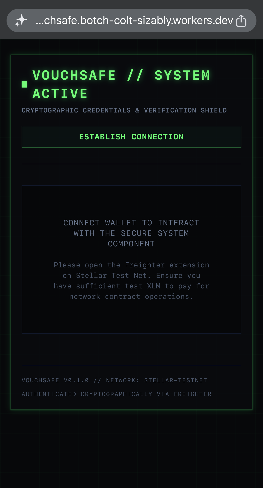
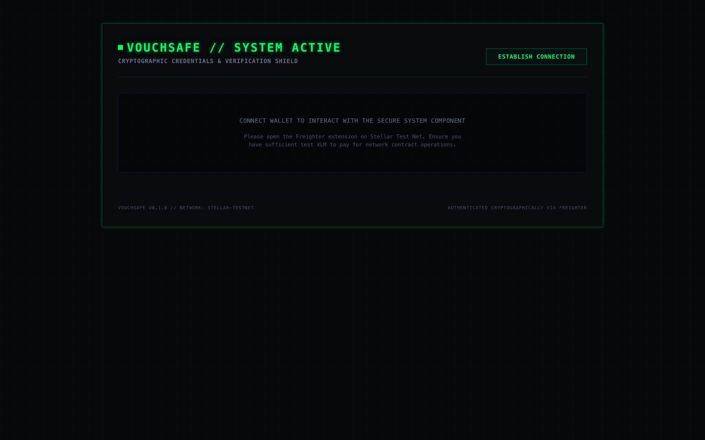
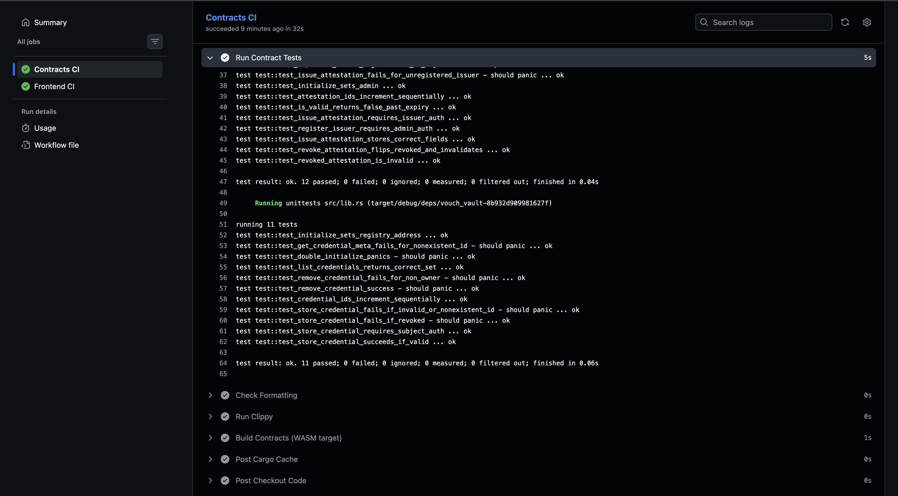

# VouchSafe — Cryptographic Credentials & Verification Shield

[](https://github.com/piyush-mittal-45/vouchsafe/actions/workflows/ci.yml)
[](https://stellar.expert/explorer/testnet)
[](https://soroban.stellar.org)
[](LICENSE)

**Live Demo:** https://vouchsafe.botch-colt-sizably.workers.dev/

**Demo Video (1–2 min):**


---

## Project Description

VouchSafe is a decentralized self-sovereign identity (SSI) credential vault built on the Stellar Soroban network. Trusted issuers publish **salted Merkle commitments** of a subject's identity attributes on-chain; the subject stores the credential metadata in their vault; and a verifier can request **selective disclosure** of specific fields. The subject reveals only the chosen fields plus a Merkle proof, and the on-chain verifier confirms the proof against the issuer's committed root — without the raw attribute values ever being stored on-chain.

Raw attribute values are encrypted client-side (AES-GCM, key derived from a wallet signature) and stored only in the browser's IndexedDB; the chain holds nothing but commitments.

## Architecture

Three specialized Soroban contracts form a single wired chain — **VouchGate → VouchVault → VouchRegistry**:

```
                        ┌──────────────────────────────────────┐
                        │  Frontend (Next.js, static export)    │
                        │  Freighter / stellar-wallets-kit      │
                        └───────────────┬──────────────────────┘
                                        │ sign + submit (Soroban RPC)
        ┌───────────────────────────────┼───────────────────────────────┐
        ▼                               ▼                               ▼
┌────────────────┐   invoke   ┌────────────────┐   invoke   ┌────────────────┐
│   VouchGate    │──────────▶ │   VouchVault   │──────────▶ │ VouchRegistry  │
│ proof requests │            │ credential meta│            │ attestations / │
│ + verification │◀────────── │ + ownership    │◀────────── │ Merkle roots   │
└────────────────┘  results   └────────────────┘  results   └────────────────┘
```

- **VouchRegistry** — issuer (endorser) authorization, attestation (`VouchRecord`) storage, Merkle root of committed attributes, revocation.
- **VouchVault** — per-subject credential metadata; on deposit it *calls into the registry* to validate the attestation and confirm the subject.
- **VouchGate** — proof requests, approvals, and selective-disclosure verification; on verification it *chains calls through the vault and registry* to fetch metadata and the committed root, then re-derives the Merkle proof on-chain.

## Tech Stack

| Layer | Technology |
| --- | --- |
| Smart contracts | Rust, `soroban-sdk` 22, compiled to `wasm32v1-none` |
| On-chain crypto | SHA-256 leaves, sorted-pair Merkle trees, `env.crypto().sha256` |
| Frontend | Next.js 14 (App Router, static export), TypeScript, Tailwind CSS |
| Wallet | `@creit.tech/stellar-wallets-kit` (Freighter) |
| Client crypto | Web Crypto AES-GCM, key derived from wallet signature |
| Network | Stellar Testnet (Horizon + Soroban RPC) |
| CI/CD | GitHub Actions (Rust + frontend jobs), Cloudflare Pages/Workers |

## Smart Contracts (Testnet)

All three contracts were deployed from the current contract source and initialized as one wired chain (Gate → Vault → Registry). Admin / deployer account: `GDQQP5KLFGAA2SHYYQ35KLU5H7JPNQDVTCCILA5FQE2DFGOLZATDL5M4`.

| Contract | Address | Stellar Expert |
| --- | --- | --- |
| **VouchRegistry** | `CBML5ICVVEU4QWWWAPHMNF3RG2QSP7YENUKUTW5H6KBQ2T6ZRFLO3NUE` | [View](https://stellar.expert/explorer/testnet/contract/CBML5ICVVEU4QWWWAPHMNF3RG2QSP7YENUKUTW5H6KBQ2T6ZRFLO3NUE) |
| **VouchVault** | `CCMNCGRMMBWSSAPMJT6SOBRKYEYL5VHISP3PMOLT6QDTHAALM42JS4IQ` | [View](https://stellar.expert/explorer/testnet/contract/CCMNCGRMMBWSSAPMJT6SOBRKYEYL5VHISP3PMOLT6QDTHAALM42JS4IQ) |
| **VouchGate** | `CBCFYEZT4VXKIRIVDA2LEVMFGRQMTBK4COCRFSRRLJSYCQ3DBR3WXN4N` | [View](https://stellar.expert/explorer/testnet/contract/CBCFYEZT4VXKIRIVDA2LEVMFGRQMTBK4COCRFSRRLJSYCQ3DBR3WXN4N) |

On-chain wiring (verifiable via read-only calls):
`VouchGate.fetch_vault_address()` → VouchVault · `VouchVault.fetch_registry_address()` → VouchRegistry.

## Inter-Contract Calls

Inter-contract calls in Soroban are executed with **`env.invoke_contract`**. VouchSafe uses two genuine cross-contract paths, both executed and verified on Testnet.

**1. Credential deposit — `VouchVault.lock_credential` → VouchRegistry (2 calls)**
Before accepting a credential, the vault calls the registry twice:
```rust
// contracts/vouch-vault/src/lib.rs
let is_valid: bool = env.invoke_contract(&registry, &symbol!("check_vouch_validity"), args);
let attestation: VouchRecord = env.invoke_contract(&registry, &symbol!("fetch_vouch"), args);
```

**2. Selective-disclosure verification — `VouchGate.authenticate_proof` → VouchVault → VouchRegistry (2-hop)**
```rust
// contracts/vouch-gate/src/lib.rs
let credential: SecureCredential = env.invoke_contract(&vault, &symbol!("fetch_credential_details"), args);
let registry: Address       = env.invoke_contract(&vault, &symbol!("fetch_registry_address"), args);
let attestation: VouchRecord = env.invoke_contract(&registry, &symbol!("fetch_vouch"), args);
// ...then re-derive the Merkle proof on-chain and emit an `audit_trail` event.
```

### On-chain evidence (full end-to-end flow, Testnet)

Every transaction below is a real, successful Testnet transaction executed against the contracts above.

| # | Call | Contract | Cross-contract? | Transaction |
| --- | --- | --- | --- | --- |
| 1 | `setup_registry` | Registry | — | [`6f9a7cdb…`](https://stellar.expert/explorer/testnet/tx/6f9a7cdbb3b4a092174e19d293310e6c3315f9c022cd1ff363b3e8a4474369c4) |
| 2 | `setup_vault` | Vault | — | [`b4c68226…`](https://stellar.expert/explorer/testnet/tx/b4c68226f3f94d6aa6c0a176313071a95dea8c046d32c63f7d7808b594e759c2) |
| 3 | `setup_gate` | Gate | — | [`fe5b7e49…`](https://stellar.expert/explorer/testnet/tx/fe5b7e49f92540d42ced94b641b3ff4a0b8f4307e81253ce0b4c316d99d4997d) |
| 4 | `authorize_endorser` | Registry | — | [`16b6904e…`](https://stellar.expert/explorer/testnet/tx/16b6904ebf85e7dd0ba4c07cd41854a4572bfbe707bc11f65946e284066ea364) |
| 5 | `register_vouch` | Registry | — | [`aeedd15b…`](https://stellar.expert/explorer/testnet/tx/aeedd15be42db0d4eedf9b3e1c1cb10bca6b4284eb97c546abbbe2acaf36fe8d) |
| 6 | **`lock_credential`** | Vault → Registry | ✅ **2 calls** | [`3d1f26ea…`](https://stellar.expert/explorer/testnet/tx/3d1f26ea1ee6f336ef319ba382de0e46ffd2924edd5eb15e160fe154255956fd) |
| 7 | `create_proof_request` | Gate | — | [`52be82b4…`](https://stellar.expert/explorer/testnet/tx/52be82b41aab01e6509f137f699cbd7733a52b2cae1371f447537cfb4ac302db) |
| 8 | **`authenticate_proof`** | Gate → Vault → Registry | ✅ **2-hop + event** | [`4f185745…`](https://stellar.expert/explorer/testnet/tx/4f185745a3c82d8ba5d325207030da6c615ef47649120a7bee482327b5766429) |

Transaction **8** returned `true` (proof verified) and emitted one `audit_trail` contract event, confirmed via the Soroban RPC `getEvents` method at its ledger.

## Wallet Connection

- Multi-wallet selection via `@creit.tech/stellar-wallets-kit`, with prominent **Connect / Disconnect** controls and a live connectivity indicator.
- Native XLM balance is fetched from Horizon and shown in the header.
- On connect, the user signs a challenge message; the signature is hashed (SHA-256) into an AES-GCM key used to encrypt/decrypt the local credential locker. The signature/key never leaves the browser.
- **Issuer authorization is deliberately not performed in the frontend.** `VouchRegistry.authorize_endorser` requires the registry admin's signature, and a static frontend cannot hold an admin key securely. Authorization is an off-app admin action (see [Setup Instructions](#setup-instructions)); an unauthorized wallet attempting to issue receives a clear, actionable error.

## Core Mechanics — Selective Disclosure (Merkle)

- **Leaf:** `sha256( xdr(Symbol name) ‖ raw_value_bytes ‖ 32-byte_salt )` — the salt hides the value (a hiding commitment).
- **Parent:** `sha256( sorted(left, right) )` — sorted-pair hashing so proofs are order-independent.
- **Root** is stored on-chain in the `VouchRecord` at issuance.
- **Disclosure:** the subject reveals `{ name, value, salt, sibling proof }` for chosen fields; `authenticate_proof` re-derives the leaf and walks the proof to the root, comparing against the registry's committed root. The identical math is implemented in `frontend/src/core/handlers/sentry-client.ts` and unit-tested against the contract logic in both Rust and Jest.

## Error Handling

Handled, user-facing states (see `frontend/src/modules/wallet/WalletKitProvider.tsx` and `GateConsole.tsx`):

1. **Wallet not found** — no compatible Stellar wallet extension detected.
2. **Signature rejected** — user declines the signing challenge (`type: 'rejected'`).
3. **Insufficient balance** — connected account below the fee threshold (`type: 'insufficient_fee'`).
4. **Wrong network** — Freighter not on Testnet.
5. **Not an authorized issuer** — actionable message pointing to the admin authorization step.

Transaction submission shows explicit **Pending → Success/Failure** loading states (`setLoadingText`) during simulation, signing, and RPC polling.

## Real-Time Updates

When `authenticate_proof` succeeds it publishes an `audit_trail` event. The dashboard polls Soroban RPC `getEvents` every 5 seconds (`getContractEvents` / `getLatestLedger` in `sentry-client.ts`) and appends new events to the live "Disclosure Ticker" without a page reload.

## Screenshots

| View | Image |
| --- | --- |
| Mobile responsive (375px) |  |
| Desktop |  |
| `cargo test` output |  |

## Setup Instructions

Prerequisites: `rustup` with the `wasm32v1-none` target, `stellar-cli`, Node 18+.

### Contracts

```bash
# Unit tests across all three contracts
cargo test --workspace

# Build production WASM
stellar contract build   # or: cargo build --workspace --target wasm32v1-none --release
```

Deploy + wire (order matters):

```bash
REG=$(stellar contract deploy   --wasm target/wasm32v1-none/release/vouch_registry.wasm --source <admin> --network testnet)
VAULT=$(stellar contract deploy --wasm target/wasm32v1-none/release/vouch_vault.wasm    --source <admin> --network testnet)
GATE=$(stellar contract deploy  --wasm target/wasm32v1-none/release/vouch_gate.wasm     --source <admin> --network testnet)

stellar contract invoke --id $REG   --source <admin> --network testnet -- setup_registry --admin <admin_addr>
stellar contract invoke --id $VAULT --source <admin> --network testnet -- setup_vault    --attestation_registry $REG
stellar contract invoke --id $GATE  --source <admin> --network testnet -- setup_gate      --credential_vault $VAULT

# Authorize an issuer (admin-only, off-app):
stellar contract invoke --id $REG --source <admin> --network testnet -- authorize_endorser --endorser <issuer_addr> --name Government
```

### Frontend

```bash
cd frontend
npm install --legacy-peer-deps
npm run dev        # local dev server
npm run test       # Jest unit tests (crypto/Merkle utilities)
npm run build      # static export -> frontend/out
```

Contract IDs can be overridden via `NEXT_PUBLIC_REGISTRY_ID`, `NEXT_PUBLIC_VAULT_ID`, `NEXT_PUBLIC_ACCESS_ID`; sensible Testnet defaults are baked in.

## Testing

- **Contracts:** `cargo test --workspace` — 36 passing tests (VouchGate 13, VouchRegistry 12, VouchVault 11) covering auth guards, init guards, sequential IDs, revocation, and selective-disclosure success/tamper/expiry cases.
- **Frontend:** `npm run test` (in `frontend/`) — 9 passing Jest tests covering the SHA-256/Merkle commitment math and proof round-trip that the contract re-verifies.

## License

MIT — see [LICENSE](LICENSE).

